# GitHub Import Architecture

## Overview

This document describes the architecture for importing GitHub repositories as portfolio projects, including the current state, why MCP isn't being used as expected, and recommended fixes.

---

## Current State: Two Disconnected Flows

There are **two separate flows** for importing GitHub projects, and they don't share the same analysis pipeline:

### Flow 1: GitHub Import UI (✅ Has AI Analysis)

```
User clicks "Import from GitHub" in UI
         ↓
POST /api/v1/github/import/confirm/
         ↓
core/integrations/github/views.py::github_import_confirm()
         ↓
GitHubSyncService.sync_repository_to_project()
         ↓
GitHubSyncService._create_project_from_repo()
         ↓
├── analyze_github_repo() ← AI ANALYSIS HAPPENS HERE
│   ├── AIProvider.complete() generates:
│   │   ├── Compelling description
│   │   ├── Category IDs (1-15)
│   │   ├── Topics (keywords)
│   │   └── Tool names
│   └── ReadmeParser.parse() extracts:
│       ├── Structured blocks
│       ├── Hero image
│       ├── Mermaid diagrams
│       └── Demo URLs
│
└── Project created with categories, topics, tools applied (lines 655-697)
         ↓
analyze_project_with_mcp.delay(project.id) ← CELERY TASK QUEUED
         ↓
GitHubAnalyzer.analyze() runs in background (additional analysis)
```

**Result:** Project has categories, topics, tools, Mermaid diagrams, structured blocks.

---

### Flow 2: Create Project Agent Chat (❌ Basic Only)

```
User sends GitHub URL in chat agent
         ↓
POST /api/v1/project/chat/stream/
         ↓
core/agents/project_chat_views.py::project_chat_stream_v2()
         ↓
project_agent.astream() (LangGraph agent)
         ↓
Tools called:
├── extract_url_info() - detects GitHub URL
├── fetch_github_metadata() - fetches basic repo info via API
└── create_project() - ONLY creates basic project
         ↓
ProjectService.create_project()
         ↓
Project.objects.create(title, description, type) ← NO AI ANALYSIS
```

**Result:** Project has only title, description, type. **No categories, no topics, no tools, no Mermaid diagrams.**

---

## Why MCP Isn't Being Used

### The MCP Infrastructure Exists But Isn't Connected

1. **MCP Client Factory exists:** `services/mcp/client_factory.py`
   - Creates FastMCP clients for GitHub, Figma
   - Supports user-specific tokens

2. **MCP Analyzers exist:** `services/analyzers/`
   - `GitHubAnalyzer` - analyzes GitHub repos
   - `FigmaAnalyzer` - analyzes Figma designs
   - `AnalyzerFactory` - routes to correct analyzer

3. **Celery task exists:** `core/projects/tasks.py::analyze_project_with_mcp()`
   - Uses `AnalyzerFactory.create_analyzer()`
   - Runs async analysis
   - Stores results in `project.content`

### The Problem: MCP Analyzer Was Refactored Away

The `GitHubAnalyzer` class was recently refactored to use **direct GitHub REST API calls** instead of the MCP server because:

```python
# services/analyzers/github.py - Line 231
# GitHub MCP endpoint was pointing to GitHub Copilot's API
# which doesn't expose standard repository tools

# MCP_SERVERS config in settings.py:
'github': {
    'url': 'https://api.githubcopilot.com/mcp',  # ← This is Copilot API, not general GitHub
}
```

**The MCP approach was abandoned** because:
1. `api.githubcopilot.com/mcp` is GitHub Copilot's internal API
2. It doesn't provide standard repo analysis tools
3. The analyzer now uses direct `requests.get()` to GitHub REST API

---

## The AI Analysis That Works

The actual AI analysis happens in a **separate file** that doesn't use MCP:

**`services/github_ai_analyzer.py::analyze_github_repo()`**

This function:
1. Takes repo data + README content
2. Calls `AIProvider.complete()` with a prompt to generate:
   - Compelling description
   - Category IDs
   - Topics
   - Tool names
3. Parses README with `ReadmeParser` for:
   - Structured blocks
   - Hero image
   - Mermaid diagrams
   - Demo URLs

This is called by `GitHubSyncService._create_project_from_repo()` but **NOT** by the Create Project Agent.

---

## Architecture Diagram

```mermaid
graph TB
    subgraph "GitHub Import UI Flow"
        A1[User clicks Import] --> B1[github_import_confirm]
        B1 --> C1[GitHubSyncService]
        C1 --> D1[_create_project_from_repo]
        D1 --> E1[analyze_github_repo]
        E1 --> F1[AIProvider.complete]
        E1 --> G1[ReadmeParser.parse]
        D1 --> H1[Apply categories/topics/tools]
        H1 --> I1[analyze_project_with_mcp.delay]
        I1 --> J1[GitHubAnalyzer - background]
    end

    subgraph "Create Project Agent Flow"
        A2[User sends GitHub URL] --> B2[project_chat_stream_v2]
        B2 --> C2[project_agent]
        C2 --> D2[fetch_github_metadata]
        D2 --> E2[GitHub REST API]
        C2 --> F2[create_project tool]
        F2 --> G2[ProjectService.create_project]
        G2 --> H2[Basic Project Only]
    end

    subgraph "MCP Infrastructure (Unused)"
        M1[MCPClientFactory]
        M2[GitHubAnalyzer]
        M3[FigmaAnalyzer]
        M4[AnalyzerFactory]
    end

    style H2 fill:#ff6b6b
    style I1 fill:#51cf66
    style M1 fill:#868e96
    style M2 fill:#868e96
    style M3 fill:#868e96
    style M4 fill:#868e96
```



---

## Technical Debt Summary

### Issue 1: Duplicate Flows
Two different entry points create projects with different quality levels.

### Issue 2: MCP Infrastructure Unused
The MCP client factory and analyzer base class exist but the GitHub analyzer bypasses them.

### Issue 3: Copilot API Misconfiguration
`MCP_SERVERS.github.url` points to Copilot API which isn't useful for repo analysis.

### Issue 4: Agent Doesn't Use Full Analysis
The Create Project Agent only creates basic projects without AI metadata.

---

## Files Involved

| File | Purpose | Status |
|------|---------|--------|
| `services/github_sync_service.py` | Full import with AI analysis | ✅ Works |
| `services/github_ai_analyzer.py` | AI metadata generation | ✅ Works |
| `services/readme_parser.py` | README block extraction | ✅ Works |
| `services/project_agent/tools.py` | Agent tools | ❌ Missing AI analysis |
| `services/project_agent/prompts.py` | Agent prompts | ❌ Not aware of full flow |
| `services/analyzers/github.py` | GitHubAnalyzer (MCP-based) | ⚠️ Uses REST API, not MCP |
| `services/mcp/client_factory.py` | MCP client factory | ⚠️ Exists but unused |
| `core/projects/tasks.py` | Celery tasks | ✅ Works (background analysis) |

---

## Recommended Fix

### Option A: Enhance the Agent (Recommended)

Add a new tool `import_github_project` that uses the full analysis pipeline:

```python
# services/project_agent/tools.py

@tool
def import_github_project(url: str, is_showcase: bool = False, config: RunnableConfig = None):
    """
    Import a GitHub repository with full AI analysis.
    
    This creates a project with:
    - AI-generated description, categories, topics
    - Structured README blocks
    - Mermaid diagrams
    - Tool associations
    """
    user_id = config['configurable']['user_id']
    user = User.objects.get(id=user_id)
    
    # Use the same service as the UI flow
    sync_service = GitHubSyncService(user)
    
    # Fetch full repo data including README
    repo_data = sync_service.fetch_repository_details(url)
    
    # Create project with full analysis
    project, was_created = sync_service.sync_repository_to_project(
        repo_data, 
        auto_publish=True, 
        add_to_showcase=is_showcase
    )
    
    return {...}
```

### Option B: Fix MCP Configuration

If you want to use MCP properly:

1. Set up a real GitHub MCP server (not Copilot)
2. Update `MCP_SERVERS.github.url` to point to it
3. Ensure the server exposes the tools GitHubAnalyzer expects

---

## Questions to Resolve

1. **Is MCP still the desired architecture?** Or should we continue with direct API calls?
2. **Should both flows exist?** Or consolidate to one entry point?
3. **What MCP server should GitHub use?** The current Copilot URL doesn't work.

---

## Current Workaround

For now, users should use the **GitHub Import UI** (not the chat agent) to get full AI-powered project pages.

The UI flow at `/api/v1/github/import/confirm/` properly calls:
- `analyze_github_repo()` for AI metadata
- `analyze_project_with_mcp.delay()` for background analysis
