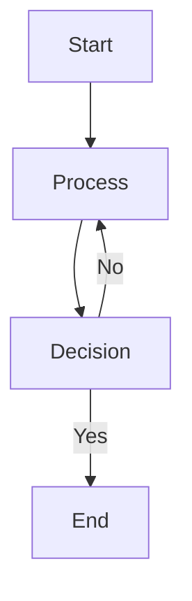
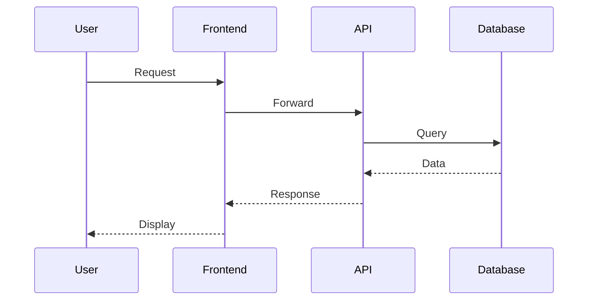
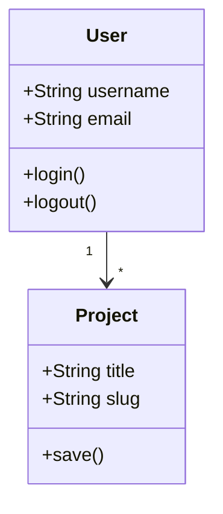
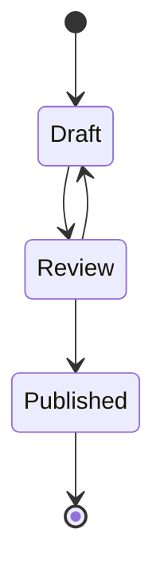
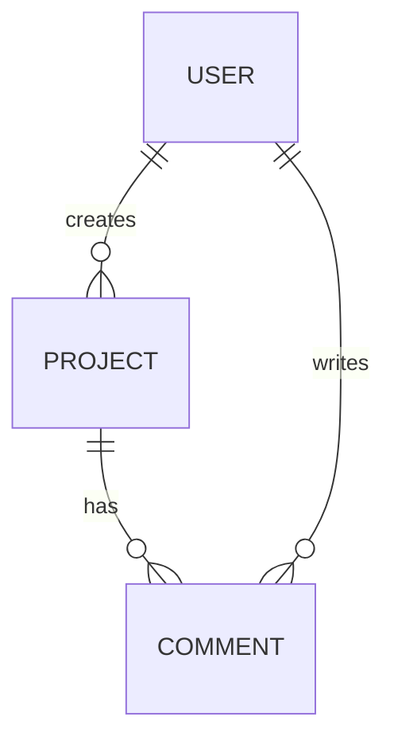
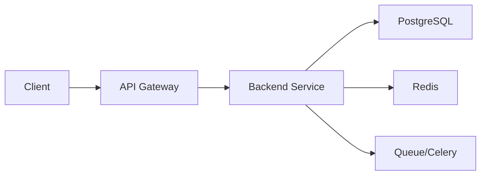
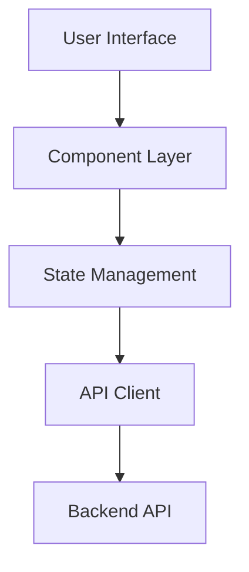
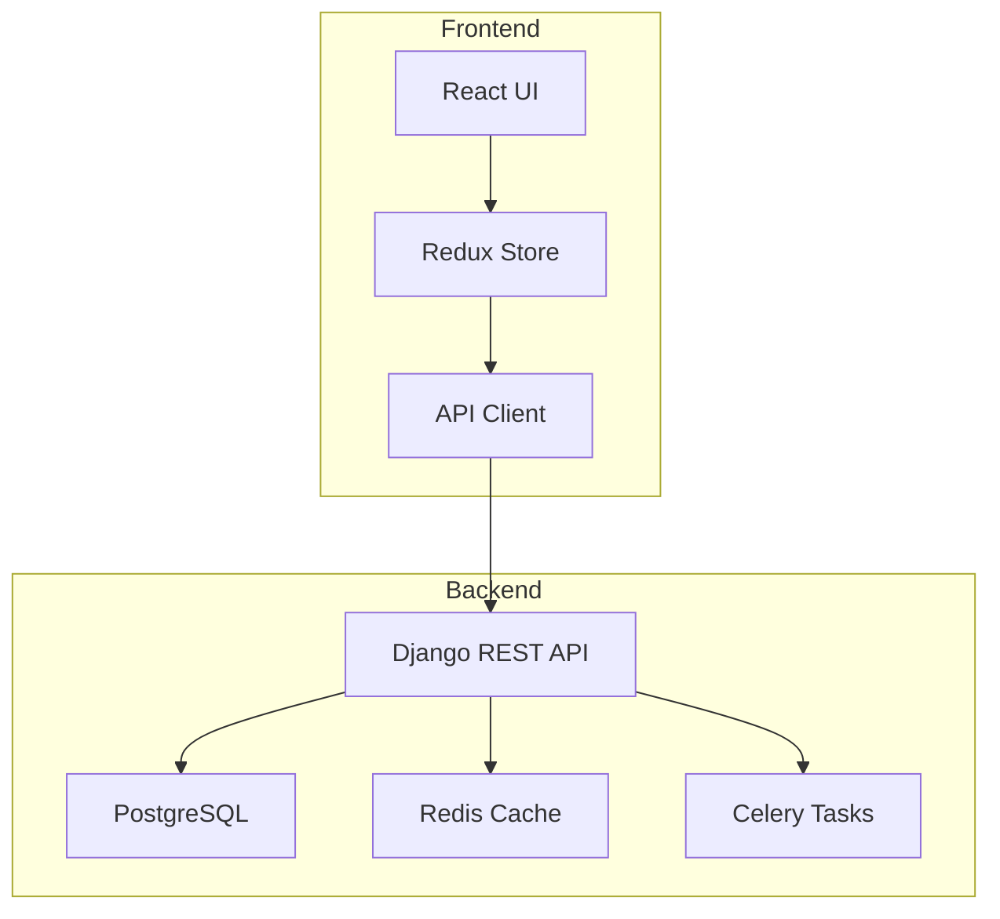
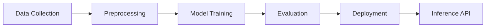
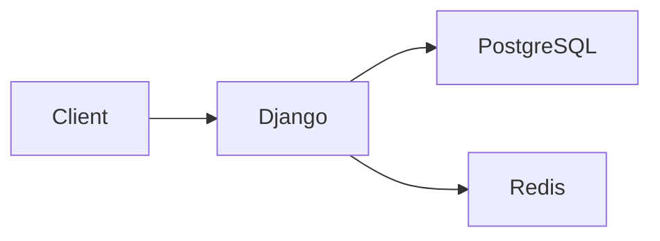

# README Parsing & Mermaid Diagram Integration

## Overview

This feature enhances GitHub project imports by parsing README files into structured portfolio blocks and supporting Mermaid diagrams for architecture visualization. When importing a GitHub project, the system automatically:

1. **Parses README structure** into portfolio-friendly blocks
2. **Extracts Mermaid diagrams** from existing README
3. **Generates architecture diagrams** if none exist
4. **Enables drag-and-drop editing** of all diagram blocks

## Architecture

### Backend Components

#### `services/readme_parser.py`

Main parser that converts markdown README into structured ProjectBlocks.

**Key Methods:**

```python
ReadmeParser.parse(readme_content: str, repo_data: dict) -> dict
```
- **Input**: Raw markdown content + repository metadata
- **Output**: Structured blocks, hero images, quotes, diagrams, demo URLs

**Features:**
- Section detection (Features, Tech Stack, Architecture, etc.)
- Image extraction and grouping
- Code block preservation
- Mermaid diagram detection
- Demo URL extraction
- Smart content categorization

```python
ReadmeParser.generate_architecture_diagram(repo_data: dict) -> str
```
- **Input**: Repository metadata (language, topics, etc.)
- **Output**: Mermaid diagram code
- **Auto-generates** diagrams for:
  - Backend projects (Django, Flask, FastAPI)
  - Frontend projects (React, Vue, Angular)
  - Full-stack applications
  - ML/AI pipelines

#### `services/github_ai_analyzer.py` (Enhanced)

Integrated with README parser to provide comprehensive project analysis.

**New Output Fields:**
- `readme_blocks`: Structured blocks from README
- `hero_image`: First significant image found
- `hero_quote`: Suggested tagline/quote
- `mermaid_diagrams`: List of detected Mermaid diagrams
- `demo_urls`: Live demo/website URLs
- `generated_diagram`: Auto-generated architecture diagram

### Frontend Components

#### `frontend/src/components/editor/MermaidBlock.tsx`

**MermaidBlock Component:**
- Real-time Mermaid diagram rendering
- Inline editing with syntax validation
- Error handling for invalid syntax
- Caption support
- Drag-and-drop positioning

**CodeSnippetBlock Component:**
- Syntax highlighting for 14+ languages
- Optional filename display
- Inline editing
- Clean code presentation

#### Updated Types (`frontend/src/types/models.ts`)

```typescript
| { type: 'mermaid'; code: string; caption?: string }
| { type: 'code_snippet'; code: string; language: string; filename?: string; highlightLines?: number[] }
```

## Usage

### Automatic README Parsing (GitHub Import)

When importing a GitHub project:

```python
from services.github_ai_analyzer import analyze_github_repo

# Fetch README from GitHub
readme_content = fetch_readme(repo_url)

# Analyze with README parsing
result = analyze_github_repo(repo_data, readme_content)

# result contains:
# - description: AI-generated compelling description
# - readme_blocks: Structured blocks from README
# - mermaid_diagrams: List of diagrams found
# - generated_diagram: Auto-generated diagram (if none found)
# - hero_image, hero_quote, demo_urls, etc.
```

### Frontend Usage

**Rendering Blocks:**

```tsx
import { BlockRenderer } from '@/components/editor/ContentBlocks';

// Blocks are rendered automatically based on type
blocks.map(block => (
  <BlockRenderer
    key={block.id}
    block={block}
    onUpdate={handleUpdate}
    onDelete={handleDelete}
  />
))
```

**Creating Mermaid Block Manually:**

```tsx
const newMermaidBlock = {
  id: uuid(),
  type: 'mermaid',
  code: `graph TD
    A[Client] --> B[API]
    B --> C[Database]`,
  caption: 'System Architecture'
};
```

## Supported Mermaid Diagram Types

The system supports all Mermaid diagram types:

### Graph/Flowchart


### Sequence Diagram


### Class Diagram


### State Diagram


### Entity Relationship


## Auto-Generated Diagrams

When no Mermaid diagrams are found in the README, the system generates appropriate diagrams based on project type:

### Backend Project (Django/Flask/FastAPI)


### Frontend Project (React/Vue/Angular)


### Full-Stack Project


### ML/AI Pipeline


## README Section Mapping

The parser intelligently maps README sections to portfolio blocks:

| README Section | Block Type | Action |
|----------------|------------|--------|
| Demo / Live Site | `button` | Extract demo URLs, create CTA buttons |
| Features / Highlights | `text` (body) | Convert to readable paragraphs |
| Tech Stack / Built With | `text` (body) | List technologies (future: `tech_stack` block) |
| Screenshots / Gallery | `imageGrid` | Group multiple images |
| Architecture / Design | `mermaid` or `image` | Diagrams or images |
| Installation / Setup | Skip | Too technical for portfolio |
| Code Examples | `code_snippet` | Preserve with syntax highlighting |
| Blockquotes | `text` (quote) | Style as quote blocks |

## Anti-AI-Slop Features

### 1. **Smart Content Filtering**
- Skips installation/setup instructions (too technical)
- Focuses on "why" and "what" over "how to install"
- Extracts visual elements first

### 2. **Hero Content Detection**
- First significant image becomes hero
- Opening paragraph (20-200 chars) becomes tagline
- Demo URLs promoted to primary CTAs

### 3. **Quality Validation**
- Validates Mermaid syntax before rendering
- Handles parsing errors gracefully
- Falls back to manual entry if parsing fails

### 4. **User Control**
- All blocks are editable via drag-and-drop
- Diagrams can be modified inline
- Users can override any auto-generated content

## Example: Complete Import Flow

```python
# 1. User adds GitHub project
repo_url = "https://github.com/user/awesome-project"

# 2. Fetch repo data from GitHub API
repo_data = {
    'name': 'awesome-project',
    'description': 'A cool Django REST API',
    'language': 'Python',
    'topics': ['django', 'rest-api', 'postgresql'],
    'stargazers_count': 42,
}

# 3. Fetch README
readme_content = """
# Awesome Project

A high-performance REST API built with Django.

## Features
- Fast and scalable
- PostgreSQL database
- Redis caching
- Celery task queue

## Architecture




## Live Demo
[Try it here](https://demo.example.com)
"""

# 4. Analyze with README parsing
result = analyze_github_repo(repo_data, readme_content)

# 5. Result contains:
{
    'description': 'High-performance Django REST API with Redis caching and Celery task queue',
    'category_ids': [9],  # Developer & Coding
    'topics': ['django', 'rest-api', 'postgresql', 'redis', 'celery'],
    'readme_blocks': [
        {'type': 'text', 'style': 'body', 'content': 'A high-performance REST API built with Django.'},
        {'type': 'text', 'style': 'heading', 'content': 'Features'},
        {'type': 'text', 'style': 'body', 'content': '- Fast and scalable\n- PostgreSQL database\n- Redis caching\n- Celery task queue'},
        {'type': 'mermaid', 'code': 'graph LR\n    A[Client] --> B[Django]\n    B --> C[PostgreSQL]\n    B --> D[Redis]', 'caption': 'Architecture'},
        {'type': 'image', 'url': 'https://example.com/screenshot.png', 'caption': 'Screenshot'},
        {'type': 'button', 'text': 'Try it here', 'url': 'https://demo.example.com', 'style': 'primary', 'size': 'large'},
    ],
    'hero_image': 'https://example.com/screenshot.png',
    'hero_quote': 'A high-performance REST API built with Django.',
    'mermaid_diagrams': ['graph LR\n    A[Client] --> B[Django]\n    B --> C[PostgreSQL]\n    B --> D[Redis]'],
    'demo_urls': ['https://demo.example.com'],
}

# 6. Create project with structured content
project = Project.objects.create(
    user=user,
    title=repo_data['name'],
    description=result['description'],
    type='github_repo',
    content={
        'blocks': result['readme_blocks'],
        'heroDisplayMode': 'image' if result['hero_image'] else 'quote',
        'heroQuote': result['hero_quote'],
    },
    featured_image_url=result['hero_image'],
    external_url=repo_url,
)
```

## Testing

### Backend Tests

```python
# Test README parsing
def test_readme_parser():
    readme = """
    # Test Project

    ```mermaid
    graph TD
        A --> B
    ```
    """

    result = ReadmeParser.parse(readme)
    assert len(result['mermaid_diagrams']) == 1
    assert 'mermaid' in [b['type'] for b in result['blocks']]
```

### Frontend Tests

```tsx
// Test Mermaid block rendering
test('renders Mermaid diagram', async () => {
  const block = {
    id: '1',
    type: 'mermaid',
    code: 'graph TD\nA-->B',
    caption: 'Test Diagram'
  };

  render(<MermaidBlock block={block} onUpdate={jest.fn()} onDelete={jest.fn()} />);

  await waitFor(() => {
    expect(screen.getByText('Test Diagram')).toBeInTheDocument();
  });
});
```

## Future Enhancements

### Phase 1 (Current)
- ✅ Parse README markdown
- ✅ Extract Mermaid diagrams
- ✅ Auto-generate architecture diagrams
- ✅ Drag-and-drop editing

### Phase 2 (Planned)
- [ ] Syntax highlighting with Prism.js
- [ ] Interactive Mermaid diagrams (clickable nodes)
- [ ] Tech stack visual block type
- [ ] GitHub stats block (stars, forks, issues)
- [ ] Animated diagram transitions

### Phase 3 (Future)
- [ ] AI-powered diagram generation from code
- [ ] README template suggestions
- [ ] Diagram collaboration/comments
- [ ] Export diagrams as images
- [ ] Diagram versioning

## Dependencies

### Backend
- Python 3.10+
- Django 4.2+
- No additional packages (uses stdlib `re`)

### Frontend
- React 19+
- `mermaid` ^11.0.0
- `@dnd-kit/core` ^6.3.1
- `@heroicons/react` ^2.2.0

## Troubleshooting

### Mermaid Diagrams Not Rendering

**Issue**: Diagrams show "Invalid diagram syntax" error

**Solutions**:
1. Verify Mermaid syntax at [Mermaid Live Editor](https://mermaid.live)
2. Check for special characters that need escaping
3. Ensure diagram type is supported (graph, flowchart, sequence, etc.)

### README Parsing Fails

**Issue**: Blocks not generated from README

**Solutions**:
1. Check README is valid markdown
2. Verify README content is not empty
3. Look for parsing errors in Django logs
4. Fallback: manually create blocks

### Performance Issues

**Issue**: Large diagrams slow down editor

**Solutions**:
1. Use collapsible sections for complex diagrams
2. Consider lazy loading for multiple diagrams
3. Optimize Mermaid rendering with `startOnLoad: false`

## Related Documentation

- [Project Model](../core/projects/models.py)
- [GitHub Sync](./GITHUB_SYNC.md)
- [GitHub AI Analyzer](../services/github_ai_analyzer.py)
- [Mermaid Documentation](https://mermaid.js.org/)
- [Content Blocks](../frontend/src/components/editor/ContentBlocks.tsx)
