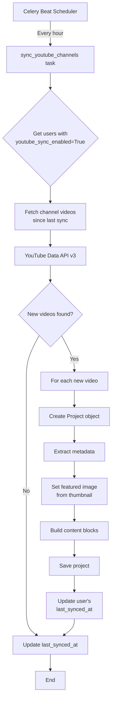

# YouTube Podcast Sync Implementation Plan

## Overview

This document describes the implementation plan for automatically importing podcast episodes from YouTube channels as portfolio projects. This feature enables content creators like Nathaniel Whittemore (AI Daily Brief) to automatically sync their YouTube podcast episodes to their AllThrive AI profile.

## Use Case

**User**: Nathaniel Whittemore
**Podcast**: The AI Daily Brief
**Platforms**: YouTube (primary), Spotify, Apple Podcasts
**Requirement**: Automatically create a new project for each YouTube video/podcast episode when published

## Architecture Overview

```
YouTube Data API v3 → Celery Beat (scheduler) → Periodic Task → Fetch New Videos → Create Projects
                                                       ↓
                                                Store in PostgreSQL
```

### Flow Diagram



## Implementation Steps

### Phase 1: Dependencies & Configuration

#### 1.1 Add YouTube Data API Library

**File**: `requirements.txt`

```diff
+ google-api-python-client>=2.100.0
+ google-auth-httplib2>=0.2.0
+ google-auth-oauthlib>=1.2.0
```

#### 1.2 Configure API Key

**File**: `.env.example` and `.env`

```bash
# YouTube Data API Configuration
YOUTUBE_API_KEY=your_youtube_api_key_here
```

**File**: `config/settings.py`

```python
# YouTube API Configuration (add after line 225)
YOUTUBE_API_KEY = config('YOUTUBE_API_KEY', default='')
```

### Phase 2: Database Schema

#### 2.1 Add User Fields for YouTube Sync

**New migration**: `core/users/migrations/XXXX_add_youtube_sync_fields.py`

```python
from django.db import migrations, models


class Migration(migrations.Migration):

    dependencies = [
        ('users', 'XXXX_previous_migration'),
    ]

    operations = [
        migrations.AddField(
            model_name='user',
            name='youtube_channel_id',
            field=models.CharField(
                max_length=100,
                blank=True,
                default='',
                help_text='YouTube channel ID for automatic podcast sync'
            ),
        ),
        migrations.AddField(
            model_name='user',
            name='youtube_sync_enabled',
            field=models.BooleanField(
                default=False,
                help_text='Enable automatic sync of YouTube videos as projects'
            ),
        ),
        migrations.AddField(
            model_name='user',
            name='youtube_last_synced_at',
            field=models.DateTimeField(
                null=True,
                blank=True,
                help_text='Timestamp of last successful YouTube sync'
            ),
        ),
    ]
```

**Update**: `core/users/models.py`

Add fields to the `User` model (around line 55, after `youtube_url`):

```python
# YouTube podcast sync settings
youtube_channel_id = models.CharField(
    max_length=100,
    blank=True,
    default='',
    help_text='YouTube channel ID for automatic podcast sync'
)
youtube_sync_enabled = models.BooleanField(
    default=False,
    help_text='Enable automatic sync of YouTube videos as projects'
)
youtube_last_synced_at = models.DateTimeField(
    null=True,
    blank=True,
    help_text='Timestamp of last successful YouTube sync'
)
```

### Phase 3: YouTube Service Integration

#### 3.1 Create YouTube Service

**New file**: `services/youtube_sync_service.py`

```python
"""YouTube Data API integration for automatic podcast sync."""

import logging
from datetime import datetime, timedelta
from typing import Any, Optional

from django.conf import settings
from django.utils import timezone
from googleapiclient.discovery import build
from googleapiclient.errors import HttpError

logger = logging.getLogger(__name__)


class YouTubeService:
    """Service for fetching YouTube channel videos and metadata."""

    def __init__(self, api_key: str | None = None):
        """Initialize YouTube service.
        
        Args:
            api_key: YouTube Data API key (defaults to settings.YOUTUBE_API_KEY)
        """
        self.api_key = api_key or settings.YOUTUBE_API_KEY
        if not self.api_key:
            raise ValueError('YouTube API key is required')
        
        self.youtube = build('youtube', 'v3', developerKey=self.api_key)

    def fetch_channel_videos(
        self,
        channel_id: str,
        since: datetime | None = None,
        max_results: int = 50
    ) -> list[dict[str, Any]]:
        """Fetch videos from a YouTube channel.
        
        Args:
            channel_id: YouTube channel ID (e.g., 'UCxxxxx')
            since: Only fetch videos published after this timestamp
            max_results: Maximum number of videos to fetch (default: 50)
        
        Returns:
            List of video metadata dictionaries
        
        Raises:
            HttpError: If YouTube API request fails
        """
        try:
            # Get channel's uploads playlist ID
            channel_response = self.youtube.channels().list(
                part='contentDetails',
                id=channel_id
            ).execute()

            if not channel_response.get('items'):
                logger.warning(f'Channel not found: {channel_id}')
                return []

            uploads_playlist_id = (
                channel_response['items'][0]
                ['contentDetails']
                ['relatedPlaylists']
                ['uploads']
            )

            # Fetch videos from uploads playlist
            videos = []
            next_page_token = None

            while len(videos) < max_results:
                playlist_response = self.youtube.playlistItems().list(
                    part='snippet,contentDetails',
                    playlistId=uploads_playlist_id,
                    maxResults=min(50, max_results - len(videos)),
                    pageToken=next_page_token
                ).execute()

                for item in playlist_response.get('items', []):
                    video_data = self._parse_video_item(item)
                    
                    # Filter by publish date if specified
                    if since and video_data['published_at'] <= since:
                        # Videos are sorted by date, so we can stop here
                        return videos
                    
                    videos.append(video_data)

                next_page_token = playlist_response.get('nextPageToken')
                if not next_page_token:
                    break

            # Enrich with video statistics
            video_ids = [v['id'] for v in videos]
            videos_with_stats = self._fetch_video_statistics(video_ids)
            
            # Merge statistics into video data
            stats_map = {v['id']: v for v in videos_with_stats}
            for video in videos:
                if video['id'] in stats_map:
                    video.update(stats_map[video['id']])

            return videos

        except HttpError as e:
            logger.error(f'YouTube API error: {e}', exc_info=True)
            raise

    def _parse_video_item(self, item: dict) -> dict[str, Any]:
        """Parse YouTube API playlist item into simplified format."""
        snippet = item['snippet']
        content_details = item['contentDetails']
        
        # Get best available thumbnail
        thumbnails = snippet.get('thumbnails', {})
        thumbnail_url = (
            thumbnails.get('maxres', {}).get('url') or
            thumbnails.get('high', {}).get('url') or
            thumbnails.get('medium', {}).get('url') or
            thumbnails.get('default', {}).get('url') or
            ''
        )

        # Parse publish date
        published_at_str = snippet.get('publishedAt', '')
        published_at = None
        if published_at_str:
            # YouTube uses ISO 8601 format
            published_at = datetime.fromisoformat(
                published_at_str.replace('Z', '+00:00')
            )

        return {
            'id': content_details['videoId'],
            'title': snippet.get('title', ''),
            'description': snippet.get('description', ''),
            'published_at': published_at,
            'thumbnail_url': thumbnail_url,
            'channel_id': snippet.get('channelId', ''),
            'channel_title': snippet.get('channelTitle', ''),
        }

    def _fetch_video_statistics(
        self,
        video_ids: list[str]
    ) -> list[dict[str, Any]]:
        """Fetch video statistics (views, duration, etc.)."""
        if not video_ids:
            return []

        try:
            # YouTube API allows max 50 IDs per request
            all_stats = []
            for i in range(0, len(video_ids), 50):
                batch = video_ids[i:i + 50]
                
                response = self.youtube.videos().list(
                    part='statistics,contentDetails',
                    id=','.join(batch)
                ).execute()

                for item in response.get('items', []):
                    stats = item.get('statistics', {})
                    content_details = item.get('contentDetails', {})
                    
                    all_stats.append({
                        'id': item['id'],
                        'view_count': int(stats.get('viewCount', 0)),
                        'like_count': int(stats.get('likeCount', 0)),
                        'comment_count': int(stats.get('commentCount', 0)),
                        'duration': content_details.get('duration', 'PT0S'),
                    })

            return all_stats

        except HttpError as e:
            logger.error(f'Error fetching video statistics: {e}')
            return []

    def video_to_project_data(self, video: dict[str, Any]) -> dict[str, Any]:
        """Convert YouTube video metadata to Project creation data.
        
        Args:
            video: Video metadata from fetch_channel_videos()
        
        Returns:
            Dictionary suitable for Project.objects.create()
        """
        # Build project title
        title = video['title']
        
        # Extract topics from description (simple approach)
        description = video['description']
        topics = self._extract_topics(description, title)

        # Build content blocks for project page
        content_blocks = [
            {
                'type': 'hero',
                'youtube_url': f"https://www.youtube.com/watch?v={video['id']}",
                'title': title,
            },
            {
                'type': 'text',
                'content': description,
            }
        ]

        return {
            'title': title,
            'description': description[:500] if len(description) > 500 else description,
            'type': 'other',  # Could extend ProjectType to add 'podcast_episode'
            'external_url': f"https://www.youtube.com/watch?v={video['id']}",
            'featured_image_url': video['thumbnail_url'],
            'published_at': video['published_at'],
            'content': {
                'youtube': {
                    'video_id': video['id'],
                    'channel_id': video['channel_id'],
                    'duration': video.get('duration', ''),
                    'view_count': video.get('view_count', 0),
                    'like_count': video.get('like_count', 0),
                    'synced_at': timezone.now().isoformat(),
                },
                'blocks': content_blocks,
            },
            'topics': topics,
            'is_showcase': True,
            'is_published': True,
        }

    def _extract_topics(self, description: str, title: str) -> list[str]:
        """Extract topics/keywords from video description and title.
        
        Simple keyword extraction. Could be enhanced with NLP/AI.
        """
        # Common podcast/AI keywords
        keywords = [
            'AI', 'Machine Learning', 'ML', 'Deep Learning', 'LLM',
            'GPT', 'ChatGPT', 'Claude', 'OpenAI', 'Anthropic',
            'Neural Network', 'Transformer', 'NLP', 'Computer Vision',
            'Reinforcement Learning', 'AGI', 'Podcast', 'Interview',
            'Technology', 'Innovation', 'Research'
        ]
        
        text = f"{title} {description}".lower()
        found_topics = []
        
        for keyword in keywords:
            if keyword.lower() in text:
                found_topics.append(keyword)
        
        # Limit to 5 topics
        return found_topics[:5] if found_topics else ['Podcast', 'AI']
```

### Phase 4: Celery Periodic Task

#### 4.1 Create Periodic Task

**New file**: `core/projects/periodic_tasks.py`

```python
"""Celery periodic tasks for project synchronization."""

import logging

from celery import shared_task
from django.contrib.auth import get_user_model
from django.utils import timezone

from core.projects.models import Project
from services.youtube_sync_service import YouTubeService

User = get_user_model()
logger = logging.getLogger(__name__)


@shared_task(bind=True, max_retries=3)
def sync_youtube_channels(self):
    """Periodic task to sync YouTube videos as projects.
    
    Runs hourly to check for new videos from users with YouTube sync enabled.
    Creates a new Project for each new video found.
    
    Returns:
        dict: Summary of sync results
    """
    logger.info('Starting YouTube channel sync task')
    
    # Get users with YouTube sync enabled
    users_to_sync = User.objects.filter(
        youtube_sync_enabled=True,
        youtube_channel_id__isnull=False
    ).exclude(youtube_channel_id='')
    
    if not users_to_sync.exists():
        logger.info('No users with YouTube sync enabled')
        return {
            'status': 'success',
            'users_synced': 0,
            'projects_created': 0,
        }
    
    youtube_service = YouTubeService()
    total_projects_created = 0
    users_synced = 0
    errors = []
    
    for user in users_to_sync:
        try:
            logger.info(
                f'Syncing YouTube channel for user {user.username} '
                f'(channel_id: {user.youtube_channel_id})'
            )
            
            # Determine sync start time
            since = user.youtube_last_synced_at or (
                timezone.now() - timezone.timedelta(days=7)  # Default: last 7 days
            )
            
            # Fetch new videos
            videos = youtube_service.fetch_channel_videos(
                channel_id=user.youtube_channel_id,
                since=since,
                max_results=50
            )
            
            logger.info(f'Found {len(videos)} new videos for {user.username}')
            
            # Create projects for new videos
            projects_created = 0
            for video in videos:
                # Check for duplicate
                video_url = f"https://www.youtube.com/watch?v={video['id']}"
                existing = Project.objects.filter(
                    user=user,
                    external_url=video_url
                ).exists()
                
                if existing:
                    logger.debug(f'Skipping duplicate video: {video["title"]}')
                    continue
                
                # Convert video to project data
                project_data = youtube_service.video_to_project_data(video)
                
                # Create project
                project = Project.objects.create(
                    user=user,
                    **project_data
                )
                
                logger.info(
                    f'Created project {project.id} for video: {video["title"]}'
                )
                projects_created += 1
            
            # Update last synced timestamp
            user.youtube_last_synced_at = timezone.now()
            user.save(update_fields=['youtube_last_synced_at'])
            
            total_projects_created += projects_created
            users_synced += 1
            
        except Exception as e:
            logger.error(
                f'Error syncing YouTube for user {user.username}: {e}',
                exc_info=True
            )
            errors.append({
                'user_id': user.id,
                'username': user.username,
                'error': str(e)
            })
    
    result = {
        'status': 'success' if not errors else 'partial_success',
        'users_synced': users_synced,
        'projects_created': total_projects_created,
        'errors': errors,
        'synced_at': timezone.now().isoformat(),
    }
    
    logger.info(f'YouTube sync completed: {result}')
    return result
```

#### 4.2 Configure Celery Beat Schedule

**File**: `config/celery.py`

```python
import os

from celery import Celery
from celery.schedules import crontab

os.environ.setdefault('DJANGO_SETTINGS_MODULE', 'config.settings')

app = Celery('allthrive_ai')
app.config_from_object('django.conf:settings', namespace='CELERY')
app.autodiscover_tasks()

# Manually discover tasks from modules not in INSTALLED_APPS
app.autodiscover_tasks(['core.projects', 'core.integrations'])

# Periodic task schedule
app.conf.beat_schedule = {
    'sync-youtube-channels': {
        'task': 'core.projects.periodic_tasks.sync_youtube_channels',
        'schedule': crontab(minute=0, hour='*/1'),  # Every hour
        'options': {
            'expires': 3600,  # Task expires after 1 hour
        }
    },
}

app.conf.timezone = 'UTC'
```

### Phase 5: User Setup

#### 5.1 Configure Nathaniel's Profile

After manually creating Nathaniel Whittemore's user account, configure YouTube sync:

**Via Django Shell** (`python manage.py shell`):

```python
from core.users.models import User

# Get or create Nathaniel's user
nathaniel, created = User.objects.get_or_create(
    username='nathaniel-whittemore',
    defaults={
        'email': 'nathaniel@example.com',  # Update with real email
        'role': 'creator',
    }
)

# Configure YouTube sync
nathaniel.youtube_channel_id = 'UC...'  # Get from YouTube channel URL
nathaniel.youtube_sync_enabled = True
nathaniel.youtube_url = 'https://www.youtube.com/@channel'
nathaniel.bio = 'Host of The AI Daily Brief podcast...'
nathaniel.save()

print(f'Configured YouTube sync for {nathaniel.username}')
```

**Finding YouTube Channel ID**:
1. Go to channel page
2. View page source
3. Search for `"channelId":"` or `"externalId":"`
4. Copy the ID (format: `UCxxxxxxxxxx`)

#### 5.2 Django Admin Configuration

Add fields to User admin (optional but recommended):

**File**: `core/admin.py`

Update the `UserAdmin` fieldsets to include YouTube sync fields.

## Deployment

### 1. Prerequisites

- YouTube Data API v3 key from [Google Cloud Console](https://console.cloud.google.com/)
- Redis running (required for Celery)
- PostgreSQL database (already configured)

### 2. Environment Setup

```bash
# Add to .env
YOUTUBE_API_KEY=your_youtube_api_key_here
```

### 3. Install Dependencies

```bash
pip install -r requirements.txt
```

### 4. Run Migrations

```bash
python manage.py makemigrations users
python manage.py migrate
```

### 5. Start Celery Workers

You need **two** Celery processes:

**Terminal 1 - Celery Worker** (processes tasks):
```bash
celery -A config worker -l info
```

**Terminal 2 - Celery Beat** (schedules periodic tasks):
```bash
celery -A config beat -l info
```

**Using Docker** (recommended):
Update `docker-compose.yml` to include:

```yaml
celery-worker:
  build: .
  command: celery -A config worker -l info
  depends_on:
    - redis
    - db
  env_file:
    - .env

celery-beat:
  build: .
  command: celery -A config beat -l info
  depends_on:
    - redis
    - db
  env_file:
    - .env
```

### 6. Verify Setup

Check Celery Beat schedule:
```bash
celery -A config inspect scheduled
```

Check active workers:
```bash
celery -A config inspect active
```

## Testing

### Manual Testing

1. **Test YouTube Service directly**:

```python
from services.youtube_sync_service import YouTubeService

service = YouTubeService()
videos = service.fetch_channel_videos(
    channel_id='UCxxxxx',
    max_results=5
)
print(f'Found {len(videos)} videos')
```

2. **Test periodic task manually**:

```python
from core.projects.periodic_tasks import sync_youtube_channels

result = sync_youtube_channels.delay()
print(result.get())
```

3. **Check created projects**:

```python
from core.projects.models import Project
from core.users.models import User

nathaniel = User.objects.get(username='nathaniel-whittemore')
projects = Project.objects.filter(user=nathaniel).order_by('-created_at')
print(f'Projects: {projects.count()}')
```

### Unit Tests

**New file**: `core/projects/tests/test_youtube_sync.py`

```python
from unittest.mock import Mock, patch
from django.test import TestCase
from django.utils import timezone
from core.users.models import User
from core.projects.models import Project
from core.projects.periodic_tasks import sync_youtube_channels


class YouTubeSyncTestCase(TestCase):
    def setUp(self):
        self.user = User.objects.create(
            username='test_podcaster',
            youtube_channel_id='UCtest123',
            youtube_sync_enabled=True
        )

    @patch('core.projects.periodic_tasks.YouTubeService')
    def test_sync_creates_projects(self, mock_youtube_service):
        # Mock YouTube API response
        mock_service = Mock()
        mock_service.fetch_channel_videos.return_value = [
            {
                'id': 'video123',
                'title': 'Test Episode',
                'description': 'Test description',
                'published_at': timezone.now(),
                'thumbnail_url': 'https://example.com/thumb.jpg',
            }
        ]
        mock_service.video_to_project_data.return_value = {
            'title': 'Test Episode',
            'description': 'Test description',
            'type': 'other',
            'external_url': 'https://www.youtube.com/watch?v=video123',
            'featured_image_url': 'https://example.com/thumb.jpg',
            'content': {},
            'topics': ['AI'],
            'is_showcase': True,
            'is_published': True,
        }
        mock_youtube_service.return_value = mock_service

        # Run sync
        result = sync_youtube_channels()

        # Verify project created
        self.assertEqual(result['projects_created'], 1)
        self.assertTrue(
            Project.objects.filter(
                user=self.user,
                external_url='https://www.youtube.com/watch?v=video123'
            ).exists()
        )
```

## Monitoring

### Logs to Monitor

1. **Celery Beat logs**: Shows when tasks are scheduled
2. **Celery Worker logs**: Shows task execution
3. **Django logs**: Shows project creation

### Key Metrics

- Number of users with sync enabled
- Projects created per sync
- API errors (rate limits, auth failures)
- Task execution time

### Monitoring Commands

```bash
# Check Celery status
celery -A config inspect stats

# Monitor task queue
celery -A config inspect active_queues

# View recent task results
celery -A config inspect reserved
```

## Error Handling

### YouTube API Errors

1. **Rate Limit Exceeded**: Task retries with exponential backoff
2. **Invalid Channel ID**: Logged, user's sync disabled
3. **Network Errors**: Task retries up to 3 times

### Project Creation Errors

1. **Duplicate Detection**: Checks `external_url` before creating
2. **Missing Data**: Falls back to defaults where possible
3. **Database Errors**: Task retries, logs full traceback

## Future Enhancements

### Phase 2: Multi-Platform Support

- Add Spotify Podcast API integration
- Add Apple Podcasts RSS feed parsing
- Link episodes across platforms (same episode, multiple URLs)

### Phase 3: AI Enhancement

- Use existing `AIProvider` to enhance descriptions
- Auto-generate categories and topics using AI
- Extract key quotes or timestamps

### Phase 4: Webhook Support

- Replace polling with YouTube PubSubHubbub webhooks
- Instant sync when new video published
- Reduce API quota usage

### Phase 5: User Interface

- Django admin panel for sync management
- User settings page to enable/configure sync
- Sync history and status dashboard

### Phase 6: Notifications

- Email user when new projects are created
- Discord/Slack webhook notifications
- RSS feed of new projects

## Troubleshooting

### Common Issues

**1. Celery Beat not running**
```bash
# Check if beat is running
ps aux | grep celery

# Restart beat
celery -A config beat -l info
```

**2. YouTube API quota exceeded**
- Default quota: 10,000 units/day
- Each sync uses ~3-5 units per video
- Monitor usage in Google Cloud Console

**3. Projects not appearing**
- Check user's `youtube_sync_enabled` flag
- Verify `youtube_channel_id` is correct
- Check Celery logs for errors

**4. Duplicate projects**
- Check `external_url` uniqueness
- Verify `youtube_last_synced_at` updates

## References

- [YouTube Data API v3 Documentation](https://developers.google.com/youtube/v3)
- [Celery Beat Documentation](https://docs.celeryproject.org/en/stable/userguide/periodic-tasks.html)
- [Google API Python Client](https://github.com/googleapis/google-api-python-client)

## Contact

For questions or issues with this implementation:
- Review logs in `logs/django.log`
- Check Celery worker/beat logs
- Contact development team

---

**Last Updated**: 2025-11-27
**Status**: Planning Phase
**Next Steps**: Begin Phase 1 implementation
