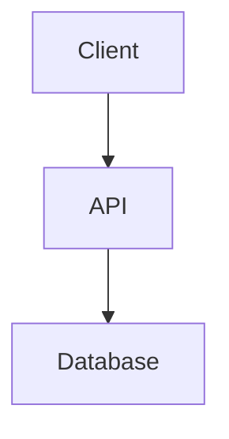
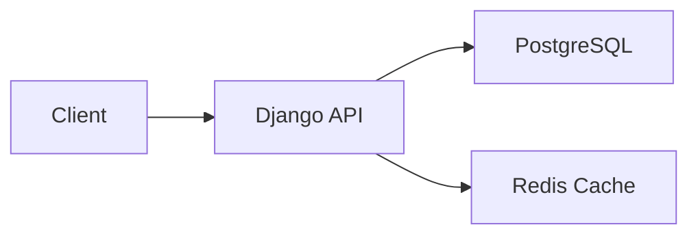

# GitHub Import with Project Details

## Overview

When importing a GitHub repository, the system automatically enriches the project with:
1. **README-parsed blocks** (structured content)
2. **Mermaid diagrams** (existing or auto-generated)
3. **Hero images and quotes** (from README)
4. **Demo/live site URLs** (from README)
5. **AI-generated metadata** (categories, topics, tools)

## Import Flow

```
GitHub URL
    ↓
Fetch repo metadata + README
    ↓
AI Analysis + README Parsing
    ↓
Extract structured content
    ↓
Create project with enriched details
    ↓
Beautiful portfolio-ready project!
```

## What Gets Imported

### 1. Basic Metadata
- **Title**: Repository name
- **Description**: AI-enhanced description (better than GitHub's)
- **External URL**: GitHub repository link
- **Type**: `github_repo`

### 2. Images
Priority order for hero image:
1. First significant image from README
2. GitHub OpenGraph social preview
3. Repository owner's avatar

Banner: Random gradient from pre-defined set

### 3. README Blocks

The README is parsed into structured ProjectBlocks:

| README Section | Block Type | Example |
|----------------|------------|---------|
| Headings (H2+) | `text` (heading) | "## Features" |
| Paragraphs | `text` (body) | Regular text content |
| Blockquotes | `text` (quote) | Hero tagline |
| Code blocks | `code_snippet` | Syntax-highlighted code |
| Mermaid diagrams | `mermaid` | Architecture diagrams |
| Images | `image` or `imageGrid` | Screenshots, demos |
| Demo links | `button` | "Try it live" CTAs |

**Sections Skipped** (too technical for portfolio):
- Installation instructions
- Setup commands
- License information

### 4. Mermaid Diagrams

**From README:**
```markdown
## Architecture


```

**Auto-generated** (if none in README):
- Backend projects → API + Database diagram
- Frontend projects → UI + State + API diagram
- Full-stack → Both frontend + backend
- ML/AI → Pipeline diagram

### 5. Demo URLs

Extracted from README links with keywords:
- "demo", "live", "website", "try"

Converted to prominent CTA buttons in the project.

### 6. Hero Quote

First compelling paragraph (20-200 chars) becomes the hero tagline:
```
"A high-performance REST API built with Django and Redis"
```

### 7. AI Metadata

**Categories** (1-2 assigned):
- Chatbots & Conversation
- Websites & Apps
- Developer & Coding
- AI Agents & Multi-Tool
- etc.

**Topics** (3-8 keywords):
```python
['django', 'rest-api', 'postgresql', 'redis', 'celery']
```

**Tools** (0-3 detected):
```python
['ChatGPT', 'GitHub Copilot', 'Claude']
```

## Storage Structure

Project `content` field (JSONField):

```json
{
  "github": {
    "url": "https://github.com/user/repo",
    "homepage": "https://demo.site.com",
    "language": "Python",
    "topics": ["django", "api"],
    "stars": 142,
    "forks": 23,
    "is_fork": false,
    "created_at": "2023-01-15T10:00:00Z",
    "updated_at": "2025-01-26T12:00:00Z"
  },
  "blocks": [
    {
      "type": "text",
      "style": "body",
      "content": "A high-performance REST API..."
    },
    {
      "type": "mermaid",
      "code": "graph TD\n  A-->B",
      "caption": "System Architecture"
    },
    {
      "type": "image",
      "url": "https://example.com/screenshot.png",
      "caption": "Dashboard View"
    },
    {
      "type": "button",
      "text": "View Demo",
      "url": "https://demo.site.com",
      "style": "primary",
      "size": "large"
    }
  ],
  "mermaid_diagrams": [
    "graph TD\n  A[Client] --> B[API]\n  B --> C[Database]"
  ],
  "demo_urls": ["https://demo.site.com"],
  "heroQuote": "A high-performance REST API built with Django",
  "heroDisplayMode": "quote",
  "tags": ["django", "rest-api", "postgresql"]
}
```

## Example Import

### Input: GitHub Repo

```
Repository: awesome-django-api
Description: REST API with PostgreSQL and Redis
Language: Python
Topics: ['django', 'rest-api', 'postgresql', 'redis']
Stars: 142
```

README.md:
```markdown
# Awesome Django API

A blazing-fast REST API built with Django, PostgreSQL, and Redis.

## Features
- Fast response times
- Scalable architecture
- Redis caching layer

## Architecture




## Live Demo
[Try it here](https://demo.awesome-api.com)
```

### Output: Project

```python
Project(
    title="awesome-django-api",
    description="Blazing-fast REST API with Django, PostgreSQL, and Redis caching for high-performance web applications",
    type="github_repo",
    external_url="https://github.com/user/awesome-django-api",
    featured_image_url="https://example.com/dashboard.png",  # From README
    banner_url="/static/gradients/gradient-1.svg",  # Random
    is_published=True,  # If auto_publish=True
    is_showcase=False,  # If add_to_showcase=False
    categories=[9],  # Developer & Coding (AI-suggested)
    topics=['django', 'rest-api', 'postgresql', 'redis', 'api'],  # AI-enhanced
    tools=[],  # No AI tools detected
    content={
        'github': {...},
        'blocks': [
            {'type': 'text', 'style': 'body', 'content': 'A blazing-fast REST API...'},
            {'type': 'text', 'style': 'heading', 'content': 'Features'},
            {'type': 'text', 'style': 'body', 'content': '- Fast response times\n- Scalable architecture\n- Redis caching layer'},
            {'type': 'mermaid', 'code': 'graph LR\n  A[Client] --> B[Django API]...', 'caption': 'Architecture'},
            {'type': 'image', 'url': 'https://example.com/dashboard.png', 'caption': 'Dashboard'},
            {'type': 'button', 'text': 'Try it here', 'url': 'https://demo.awesome-api.com', 'style': 'primary', 'size': 'large'}
        ],
        'mermaid_diagrams': ['graph LR\n  A[Client] --> B[Django API]...'],
        'demo_urls': ['https://demo.awesome-api.com'],
        'heroQuote': 'A blazing-fast REST API built with Django, PostgreSQL, and Redis.',
        'heroDisplayMode': 'quote'
    }
)
```

## User Experience

### Before (Plain Import)
```
✅ Title: "awesome-django-api"
✅ Description: "REST API with PostgreSQL and Redis"
❌ No structured content
❌ No diagrams
❌ No demo links
❌ Generic thumbnail
```

### After (Enriched Import)
```
✅ Title: "awesome-django-api"
✅ AI-enhanced description
✅ README parsed into blocks
✅ Mermaid architecture diagram
✅ Screenshots from README
✅ "Try it here" demo button
✅ Hero quote: "A blazing-fast REST API..."
✅ Featured image from README
✅ Categories, topics, tools tagged
```

## Code Implementation

### Backend Service
**File**: `services/github_sync_service.py`

```python
def _create_project_from_repo(self, repo, auto_publish, add_to_showcase):
    # ... fetch repo data ...

    # AI analysis + README parsing
    ai_metadata = analyze_github_repo(repo, readme_content)

    # Extract enriched details
    readme_blocks = ai_metadata.get('readme_blocks', [])
    mermaid_diagrams = ai_metadata.get('mermaid_diagrams', [])
    hero_image = ai_metadata.get('hero_image')
    hero_quote = ai_metadata.get('hero_quote')
    demo_urls = ai_metadata.get('demo_urls', [])

    # Build content structure
    content = {
        'github': {...},
        'blocks': readme_blocks,
        'mermaid_diagrams': mermaid_diagrams,
        'demo_urls': demo_urls,
        'heroQuote': hero_quote,
        'heroDisplayMode': 'quote' if hero_quote else 'image'
    }

    # Create project with enriched content
    project = Project.objects.create(
        user=self.user,
        title=name,
        description=ai_enhanced_description,
        content=content,
        featured_image_url=hero_image or github_og_image,
        # ... other fields ...
    )
```

### AI Analyzer
**File**: `services/github_ai_analyzer.py`

```python
def analyze_github_repo(repo_data, readme_content):
    # AI generates description, categories, topics, tools
    ai_result = call_ai_api(...)

    # Parse README into structured blocks
    if readme_content:
        readme_parsed = ReadmeParser.parse(readme_content, repo_data)
        ai_result.update({
            'readme_blocks': readme_parsed['blocks'],
            'hero_image': readme_parsed['hero_image'],
            'hero_quote': readme_parsed['hero_quote'],
            'mermaid_diagrams': readme_parsed['mermaid_diagrams'],
            'demo_urls': readme_parsed['demo_urls'],
        })

        # Generate diagram if none found
        if not readme_parsed['mermaid_diagrams']:
            generated = ReadmeParser.generate_architecture_diagram(repo_data)
            if generated:
                ai_result['generated_diagram'] = generated

    return ai_result
```

### README Parser
**File**: `services/readme_parser.py`

```python
class ReadmeParser:
    @staticmethod
    def parse(readme_content, repo_data):
        # Parse markdown into sections
        sections = split_by_headings(readme_content)

        blocks = []
        for section in sections:
            # Extract Mermaid diagrams
            mermaid = extract_mermaid(section)

            # Extract images
            images = extract_images(section)

            # Extract demo URLs
            demo_urls = extract_demo_links(section)

            # Convert to structured blocks
            blocks.extend(create_blocks(section))

        return {
            'blocks': blocks,
            'hero_image': first_significant_image,
            'hero_quote': first_compelling_paragraph,
            'mermaid_diagrams': found_diagrams,
            'demo_urls': demo_links
        }
```

## Viewing Imported Projects

Projects with enriched details display:
- **Hero section**: Quote or featured image
- **Content blocks**: Draggable, editable sections
- **Mermaid diagrams**: Interactive, rendered diagrams
- **Code snippets**: Syntax-highlighted examples
- **Demo buttons**: Prominent CTAs
- **Image galleries**: Screenshots from README

Users can:
- ✅ Drag and drop blocks to reorder
- ✅ Edit any block inline
- ✅ Add/remove blocks
- ✅ Modify Mermaid diagrams
- ✅ Change hero display mode

## Benefits

### For Users
- ⚡ **Instant portfolio** from GitHub projects
- 🎨 **Beautiful layouts** without manual work
- 📊 **Visual diagrams** auto-generated
- 🔗 **Demo links** prominently displayed
- ✏️ **Fully editable** after import

### For Developers
- 🚀 **Showcase projects** easily
- 📝 **README becomes portfolio** automatically
- 🎯 **Better discoverability** with tags
- 💼 **Professional presentation** without effort

## Related Documentation

- [README Parser](./README_MERMAID_INTEGRATION.md) - README parsing details
- [GitHub Sync](./GITHUB_SYNC.md) - GitHub OAuth and sync
- [Project Cache Fix](./PROJECT_CACHE_FIX.md) - Cache invalidation
- [AI Analyzer](../services/github_ai_analyzer.py) - AI metadata generation
