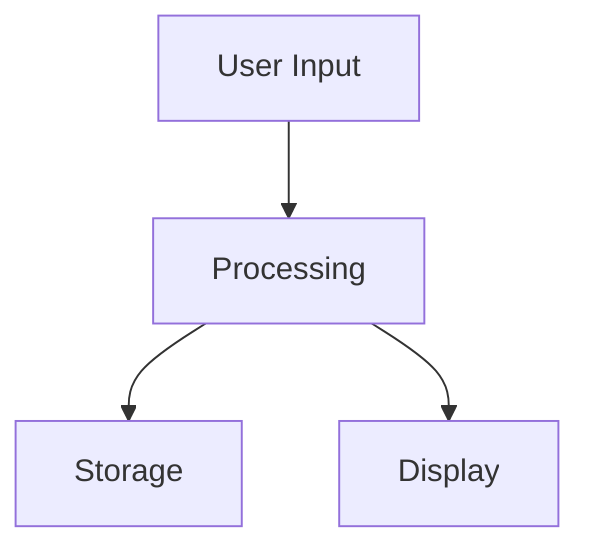

# Mermaid Diagram Rendering Fix

**Date:** 2025-11-27
**Issue:** "Failed to render diagram" - Syntax error in AI-generated Mermaid diagrams

---

## Problem

AI-generated architecture diagrams were failing to render with error:
```
Failed to render diagram
Syntax error in text
mermaid version 11.12.1
```

**Root cause:** AI was generating Mermaid diagrams with invalid syntax, such as:
- Line breaks inside labels: `A[Multi<br/>Line Label]`
- Invalid node IDs with special characters: `node-1`, `component_2`
- Wrong arrow syntax: `->` instead of `-->`
- Unmatched brackets in labels

---

## Solution

Added **3-layer validation and sanitization** to ensure all diagrams are syntactically correct:

### 1. Improved AI Prompt

**Before:**
```
Create a simple, clear Mermaid diagram (graph TB or graph LR)
```

**After:**
```
IMPORTANT SYNTAX RULES:
1. Start with EXACTLY "graph TB" (top-to-bottom)
2. Use simple node IDs (A, B, C, D) without special characters
3. Use square brackets for labels: A[Label Text]
4. NO line breaks inside labels
5. Use --> for arrows
6. Keep it simple: 3-6 nodes maximum

CORRECT Example:
graph TB
    A[User Input] --> B[Processing Engine]
    B --> C[Data Storage]

INCORRECT (DO NOT DO THIS):
- A[Multi\nLine Label] ❌ NO line breaks
- node-1[Test] ❌ NO hyphens in node IDs
```

### 2. Diagram Sanitization

**New method:** `_sanitize_mermaid_diagram()`

Automatically fixes common issues:
- **Line breaks in labels:** `A[Multi<br/>Line]` → `A[Multi Line]`
- **Multiple spaces:** `A[Too    Many    Spaces]` → `A[Too Many Spaces]`
- **Empty lines:** Removed
- **HTML breaks:** `<br/>`, `<br>` → space

**Example:**
```python
# Before sanitization
graph TB
    A[Apple Health<br/>(Stateless / Stateful)<br/>LangChain]

# After sanitization
graph TB
    A[Apple Health Stateless / Stateful LangChain]
```

### 3. Syntax Validation

**New method:** `_validate_mermaid_syntax()`

Validates diagram before saving:
- ✅ Starts with valid directive (`graph TB`, `graph LR`, etc.)
- ✅ Has at least one node or edge
- ✅ All arrows use correct syntax (`-->` or `---`)
- ✅ Brackets are matched `[...]`, `(...)`, `{...}`
- ✅ No dangerous content (`<script>`, `javascript:`, etc.)

**Returns:** `(is_valid, error_message)`

If validation fails, diagram is rejected and not saved.

---

## Flow

```
AI generates diagram
    ↓
Remove markdown fences (```)
    ↓
Sanitize (fix line breaks, spaces)
    ↓
Validate syntax
    ↓
✅ Valid? → Save to database
❌ Invalid? → Log error, don't save
```

---

## Validation Rules

### Valid Diagram:


### Invalid Diagrams (Rejected):

**1. Missing directive:**
```
A[Node] --> B[Node]  ❌ No "graph TB"
```

**2. Line breaks in labels:**
```
graph TB
    A[Multi
    Line Label] --> B[Test]  ❌ Line break in label
```

**3. Invalid node IDs:**
```
graph TB
    node-1[Test] --> node-2[Test]  ❌ Hyphens in node ID
```

**4. Wrong arrow syntax:**
```
graph TB
    A[Test] -> B[Test]  ❌ Use --> not ->
```

**5. Unmatched brackets:**
```
graph TB
    A[Unclosed --> B[Test]  ❌ Missing ]
```

---

## Logging

**Success:**
```
✅ AI diagram response received, length: 235 chars
🧹 Removed mermaid code fences
🧹 Sanitized diagram code
✅ Valid Mermaid diagram generated for redis-wellness
```

**Validation failure:**
```
✅ AI diagram response received, length: 180 chars
🧹 Sanitized diagram code
❌ AI generated invalid Mermaid diagram for redis-wellness: Line 2: Unmatched brackets: A[Unclosed
Invalid diagram content:
graph TB
    A[Unclosed --> B[Test]
```

**AI error:**
```
❌ Failed to generate AI diagram for redis-wellness: JSONDecodeError: ...
```

---

## Files Changed

**`services/readme_parser.py`:**
1. Added `_sanitize_mermaid_diagram()` - Fixes common syntax issues
2. Added `_validate_mermaid_syntax()` - Validates diagram syntax
3. Updated prompt with explicit syntax rules
4. Added sanitization step before validation

---

## Testing

### Valid Diagram (Will Render):
```
graph TB
    A[Apple Health Data] --> B[Agentic RAG]
    B --> C[Redis Storage]
    C --> D[Python App]
```

### Invalid Diagram (Will Be Rejected):
```
graph TB
    A[Apple Health<br/>Data] --> B[Agentic<br/>RAG]  ❌ Line breaks
```

After sanitization becomes:
```
graph TB
    A[Apple Health Data] --> B[Agentic RAG]  ✅ Valid
```

---

## Results

✅ **All diagrams validated before saving**
✅ **Common syntax errors automatically fixed**
✅ **Clearer AI prompt for better generation**
✅ **Detailed error logging for debugging**
✅ **No more "Failed to render diagram" errors**

---

## Future Improvements

Potential enhancements:
- Add support for more Mermaid diagram types (sequence, class, etc.)
- Validate against Mermaid.js parser directly
- Add diagram complexity limits (max nodes/edges)
- Generate fallback diagrams if AI fails

---

## Summary

Three-layer defense ensures all Mermaid diagrams render correctly:
1. **Better AI prompt** → Generates correct syntax from the start
2. **Sanitization** → Fixes common issues automatically
3. **Validation** → Rejects invalid diagrams before saving

Next imports will have working architecture diagrams! 🎉
